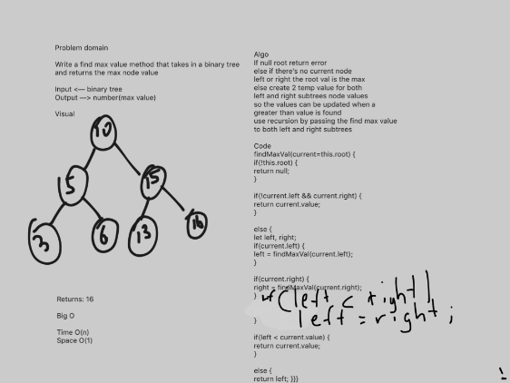

Code Challenge 18
=========================================================
### Author - Sarkis Aghazarian

* [Repo](https://github.com/sarkis74/data-structures-and-algorithms/tree/master/401-code-challenges/FindMaxVal_binary_tree)

## Challenge
* Find the Maximum Value in a Binary Tree 

## Overview
* Write a function called find-maximum-value which takes binary tree as its only input. Without utilizing any of the built-in methods available to your language, return the maximum value stored in the tree. You can assume that the values stored in the Binary Tree will be numeric.

## Approach & Efficiency
* traverse each node in the tree.
* find the maximum value in a node
* return the maximum value

## Tests
* it should insert node values in the tree
* it should traverse the tree and each node to find the maximum value

## Big O
* Space => O(n)
* Time => O(1)

## Solution
